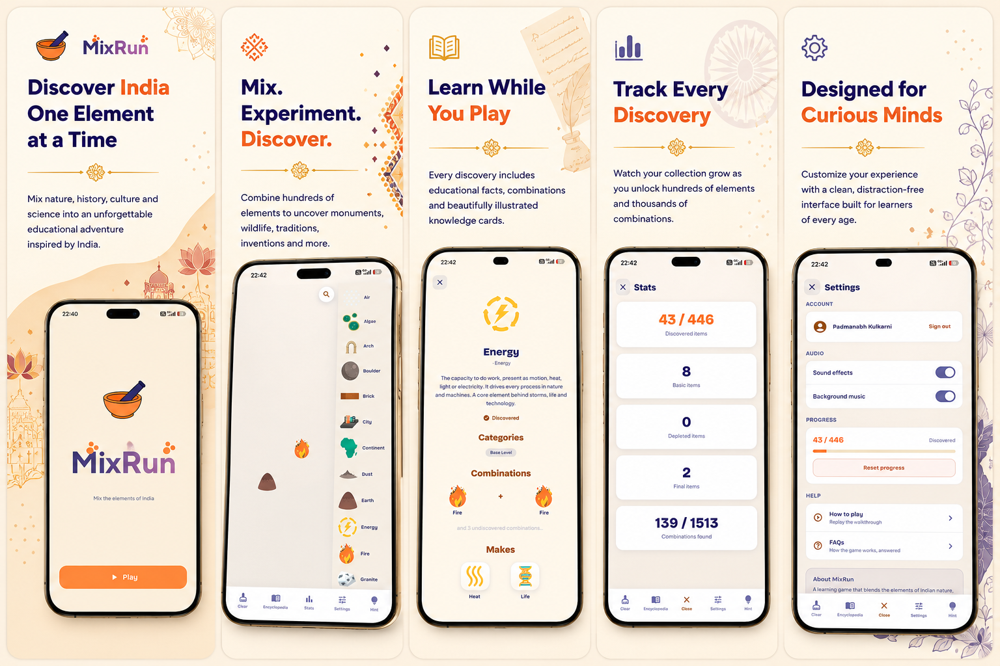

# MixRun

**A gentle crafting game that turns curiosity into discovery, and quietly teaches kids about the world around them.**



---

## What is MixRun?

MixRun starts you with just four things: **Earth, Water, Fire, and Air**. Drag two together and watch something new appear. Mix those results again, and again, and a whole world unfolds under your fingertips: **hundreds of items to discover**, from clouds and rivers to festivals, monuments, art forms, and the heroes who shaped a nation.

There's no timer, no losing, and no pressure. Just the quiet joy of *"what happens if I combine these two?"*, the same spark that makes kids take things apart to see how they work.

### Why children (and parents) love it

- **Discovery, not instructions.** Every new item is a little reward the player earns by experimenting. It builds patience, pattern-recognition, and creative thinking.
- **It sneaks in real learning.** MixRun's world is built around **Indian heritage**: its states, history, culture, arts, and heroes. Discover an item and you can tap **"Read More"** for a kid-friendly explanation, or **"Watch a Video"** to see it come alive. Curiosity leads straight to knowledge.
- **Safe by design.** Videos are curated and filtered for safe viewing. There's no chat, no strangers, and the game plays perfectly **offline**, with no account required to start.
- **A journey to travel.** Items are grouped into themed stages: a **Base** world of nature and science, then stops through **States, History, Culture, Arts, and Heroes**, unlocked step by step as a child explores.
- **Made for everyone.** MixRun is being built for **16 languages** so children can play and learn in the words they know best. (More on how you can help below!)

Whether it's a five-minute wind-down or a rainy afternoon of exploring, MixRun is a calm, screen-time-you-can-feel-good-about kind of game.

---

## A huge shoutout to Little Alchemy 2

MixRun stands entirely on the shoulders of **[Little Alchemy 2](https://littlealchemy2.com/)**, the wonderful game that invented and perfected this "combine two things to make a third" magic. If you love MixRun's core idea, it's because Little Alchemy 2 got it so right first.

MixRun is a heartfelt homage: the same joyful mechanic, reimagined as a journey through Indian heritage and built as a learning tool for children. All the credit for the original spark goes to the Little Alchemy 2 team. **Thank you.**

---

## For developers & contributors

**MixRun is open to your help. Anyone is welcome to raise a Pull Request.**

This is a Flutter project, and the game world is intentionally easy to tweak. You don't have to be a game designer to make it better. Here's how you can pitch in:

- **Suggest or fix items.** Think an item's description could be clearer, a combination doesn't make sense, or there's a great heritage item we're missing? Open a PR or an issue with your idea. The catalog is designed to be edited.
- **Fix broken links.** Every item carries a "Read More" article link and a "Watch a Video" link. Links rot over time, so if you spot a dead or wrong one, please send a fix. (Small corrections can even be pushed without a full release; see *Fixing a broken "learn more" link* below.)
- **Help translate the game.** This is one of the biggest ways to help. MixRun is wired for **16 locales** but is currently **English-only**. If you speak another language, you can help translate both the interface and the item content so more children can play in their own language. Contributions here are hugely appreciated.
- **Report bugs & propose features.** Found something broken or have an idea? Open an issue. Clear reproduction steps make fixes fast.

**How to contribute:** fork the repo, make your change on a branch, and open a PR describing *what* you changed and *why*. No change is too small; fixing a typo in an item description genuinely helps a kid somewhere learn something correctly.

> A note on the data files: the game catalog is public and lives right in the repo (see *Game data* below). To suggest an item or content change, edit `lib/data/game_data.dart` directly and open a PR so your intent is clear.

---

## Game data

The full game catalog is **public and committed to the repo**, so you can read
and edit it directly. There is nothing to copy before building.

| File                          | What it holds                                                                 |
| ----------------------------- | ----------------------------------------------------------------------------- |
| `lib/data/game_data.dart`     | Every item: name, description, category, article/video links, and the recipes that combine them |
| `lib/data/game_levels.dart`   | How items are grouped into the Journey's themed stages                        |
| `lib/data/element_icons.dart` | The icon mapping for each item                                                |

Each file has an `*.example.dart` companion kept alongside it as a small,
self-contained reference version. You do not need it to build; the real files
above are what the app uses.

To change an item, edit its entry in `lib/data/game_data.dart` and open a PR.

## Secrets and local config

Nothing in this repo contains a live credential. The values that identify the
real Firebase and AdMob accounts are supplied locally and are **gitignored**, so
a clone builds and runs without them.

| Real file / value (gitignored)       | How to supply it                              |
| ------------------------------------ | --------------------------------------------- |
| `android/app/google-services.json`   | copy `google-services.example.json`, fill in your Firebase project |
| `android/local.properties`           | `admob.appId=ca-app-pub-XXX~YYY`              |
| Rewarded ad unit                     | `--dart-define=ADMOB_REWARDED_AD_UNIT_ID=...` |
| Test device ids                      | `--dart-define=ADMOB_TEST_DEVICE_IDS=HASH1,HASH2` |

**Firebase.** Without `google-services.json` the app runs fully offline with
account features disabled,  `main.dart` catches the init failure, and
`build.gradle.kts` only applies the Google Services plugin when the file exists.
To enable accounts, copy the template and replace every `REPLACE_ME` value with
your own project's:

```sh
cp android/app/google-services.example.json android/app/google-services.json
```

**AdMob.** The app id is injected into `AndroidManifest.xml` as a manifest
placeholder by `android/app/build.gradle.kts`, read from `admob.appId` in
`android/local.properties` (or `-Padmob.appId=`, or an `ADMOB_APP_ID` env var
for CI). With none set it falls back to Google's public test app id, so a fresh
clone builds and serves test ads without an AdMob account.

The rewarded ad unit works the same way: release builds use
`ADMOB_REWARDED_AD_UNIT_ID` when defined, and otherwise fall back to Google's
sample unit rather than requesting a unit that doesn't exist.

```sh
flutter build apk --release \
  --dart-define=ADMOB_REWARDED_AD_UNIT_ID=ca-app-pub-XXX/YYY
```

**Test devices.** Registering your handset makes AdMob serve *test* creatives
you can safely tap,  tapping a live ad on your own app is invalid traffic and
can get the account suspended. Device ids are personal to a handset, so they are
passed at build time and never committed:

```sh
flutter run --dart-define=ADMOB_TEST_DEVICE_IDS=33BE2250B43518CCDA7DE426D04EE231
```

**Release signing.** The release build currently signs with the debug keys (see
the TODO in `android/app/build.gradle.kts`). When you add a real keystore, keep
it out of git,  `*.jks`, `*.keystore` and `key.properties` are already ignored.
A leaked keystore lets anyone publish an update impersonating this app.

## Fixing a broken "learn more" link

Every element ships with an article URL and (once curated) a video URL baked
into `lib/data/game_data.dart`. Links rot, so those can be corrected
server-side without releasing an update.

Edit the Firestore document **`config/links`**. It holds only the links that
have broken, not a copy of the catalog:

```json
{
  "items": {
    "tajmahal": { "v": "https://www.youtube.com/watch?v=NEW_ID" },
    "sitar":    { "u": "https://en.wikipedia.org/wiki/Sitar" }
  }
}
```

- `u` replaces the article URL, `v` replaces the video URL. Set only the one
  that broke; the other keeps its baked-in value.
- Keys are element ids from `game_data.dart`. An id that doesn't exist is
  ignored.
- Deploy `firestore.rules` (`firebase deploy --only firestore:rules`) so the
  document is world-readable and client-writable by nobody. Most players never
  sign in, and a fix is only useful if it reaches them too.

Clients apply the cached copy before the first frame and refresh in the
background at most every 12 hours, so corrections reach players on their next
launch or two. Every failure path (no Firebase, offline, permission denied, a
malformed document) falls back to the link baked into the app.

## Building & running

MixRun is a standard Flutter app. After copying the templates above:

```sh
flutter pub get
flutter run
```

New to Flutter? These will get you set up:

- [Install Flutter](https://docs.flutter.dev/get-started/install)
- [Lab: Write your first Flutter app](https://docs.flutter.dev/get-started/codelab)
- [Flutter documentation](https://docs.flutter.dev/)

---

*MixRun is a fan-made, educational homage to Little Alchemy 2. Come build a little world, and help us make it better for kids everywhere.*
